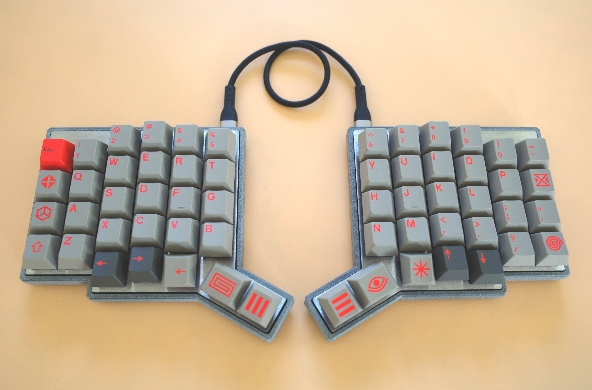

# Pando Keyboard

Pando is a wired 58-key column-staggered split keyboard. It uses an integrated MCU design on the STM32 platform (STM32G0B1) with an IO expander (PCA9555) on the secondary half, connected over USB-C.

> [!NOTE]
> 📘 The **[Documentation pages](https://jyap808.github.io/pando)** contain a Build and Firmware guide.

> [!TIP]
> 🚀 Want one? Pre-assembled and PCB-tested kits are available on [Etsy](https://www.etsy.com/listing/4567044197/). Your support helps me keep this project open-source and encourages the development of new models!

## Features

- STM32G0B1KBT6 MCU (64 MHz Cortex-M0+, 144 KB SRAM)
- PCA9555 IO expander on the secondary half
- USB-C split communication with ESD protection on all ports
- Hotswap switch sockets
- Single-sided SMD components for hotplate soldering
- Vial firmware for keymap configuration
- Same key layout as the [Pando58](https://jyap808.github.io/pando58), but as an assembled PCB instead of a DIY kit

## Repository

| Directory | Description |
| --------- | ----------- |
| `kicad/` | Schematics and PCB (left, right, switch plates) |
| `firmware/` | QMK/Vial keyboard definition |
| `ergogen/` | Layout configuration and case/plate generation |
| `case/` | 3D printed case models (FreeCAD) |
| `docs/` | This project's documentation site (built with [Zensical](https://zensical.org/)) |

## Firmware

Pando runs [Vial](https://get.vial.today/) firmware. Precompiled builds are on [GitHub Releases](https://github.com/jyap808/pando/releases) — flash with `dfu-util`, or build from source with the keyboard definition in `firmware/keyboards/`. See [Installing Firmware](https://jyap808.github.io/pando/firmware/installing-firmware/) for details.

## License

[Pando Keyboard](https://github.com/jyap808/pando) © 2026 by [Julian Yap](https://julianyap.com/) is Open Hardware, licensed under [CERN-OHL-S v2](https://ohwr.org/cern_ohl_s_v2.txt). See [LICENSE](LICENSE).

The firmware in `firmware/` is licensed under the [GPL v2](https://www.gnu.org/licenses/old-licenses/gpl-2.0.html).