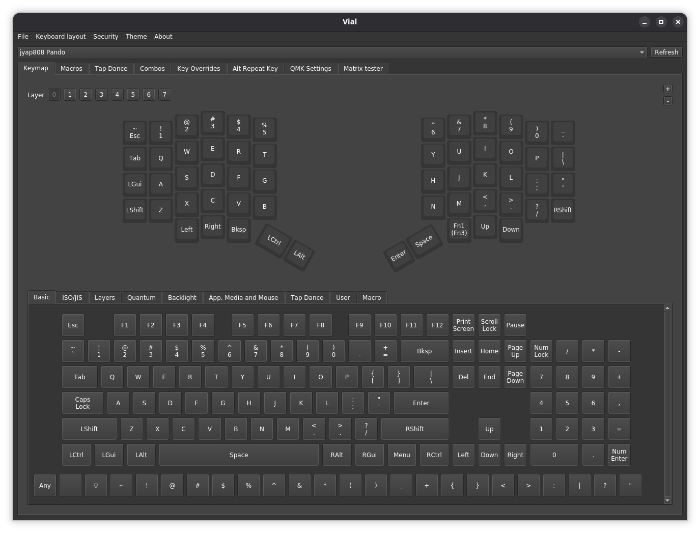

# Firmware and Configuration

Pando uses Vial firmware. Once installed, [Vial](https://get.vial.today/) (the application) is used to configure the keyboard.

Pre-built keyboards from my [Etsy Store](https://www.etsy.com/shop/ReplicantWorks) arrive pre-flashed with firmware and fully PCB-tested, ready to use out of the box.

To flash the keyboard yourself, see [Installing Firmware](installing-firmware.md).

## Getting Vial

Download Vial (the desktop application) from the [official website](https://get.vial.today/) for your platform.

Alternatively, you can use [Vial Web](https://vial.rocks) in your browser — no download required.

## Configuring with Vial

Open [Vial](https://get.vial.today/) to configure the keyboard. The Pando should connect automatically when the firmware is installed.

Vial allows you to remap keys, create layers, and configure macros for your Pando keyboard.
