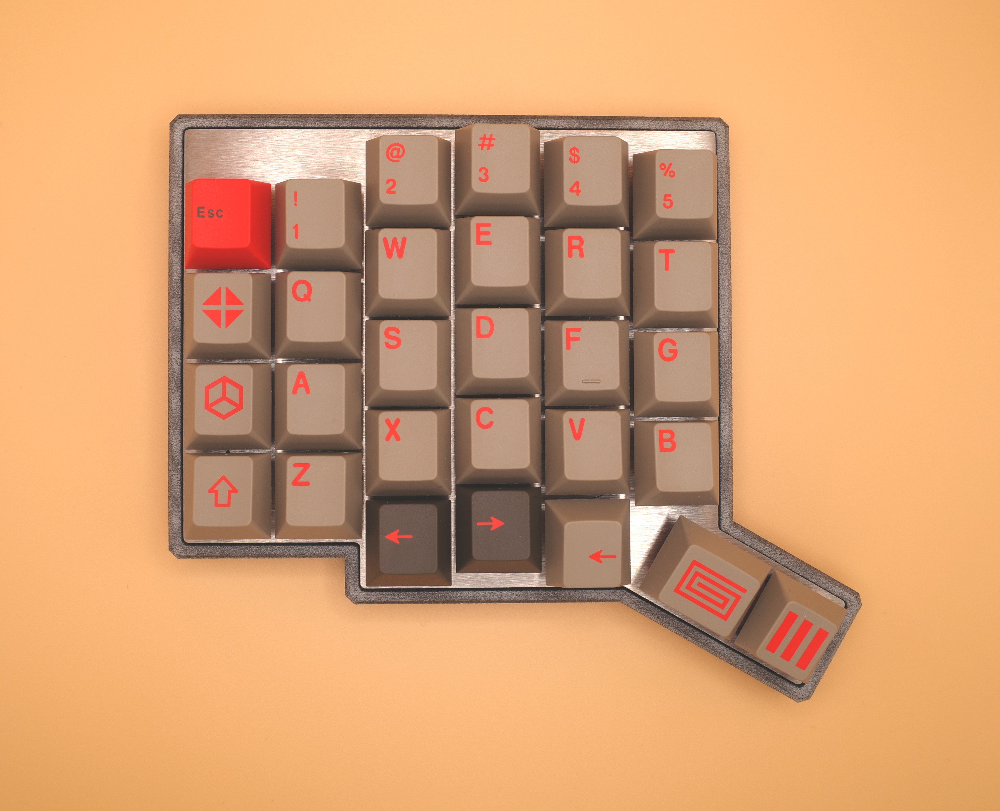
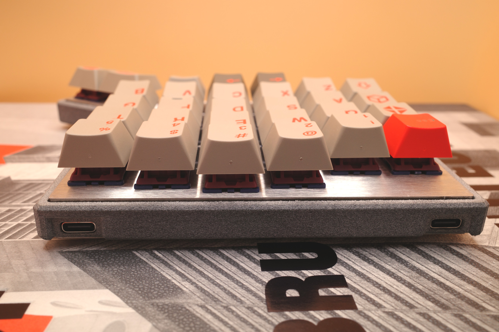
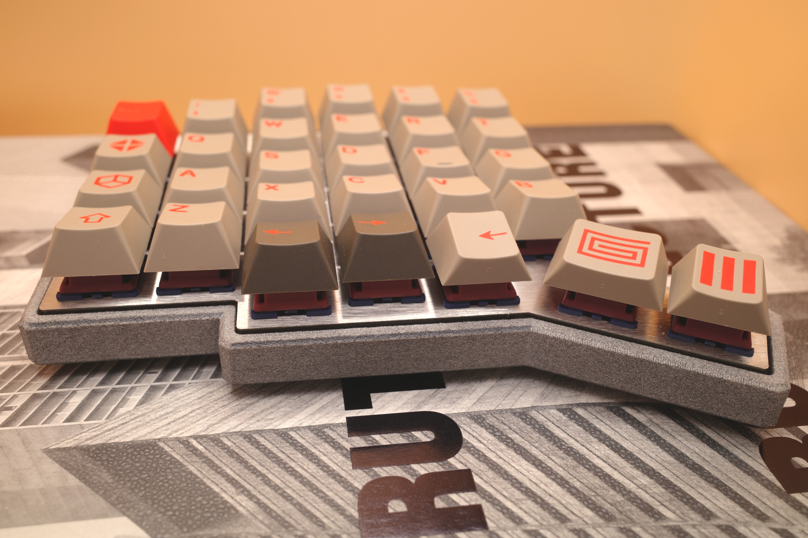
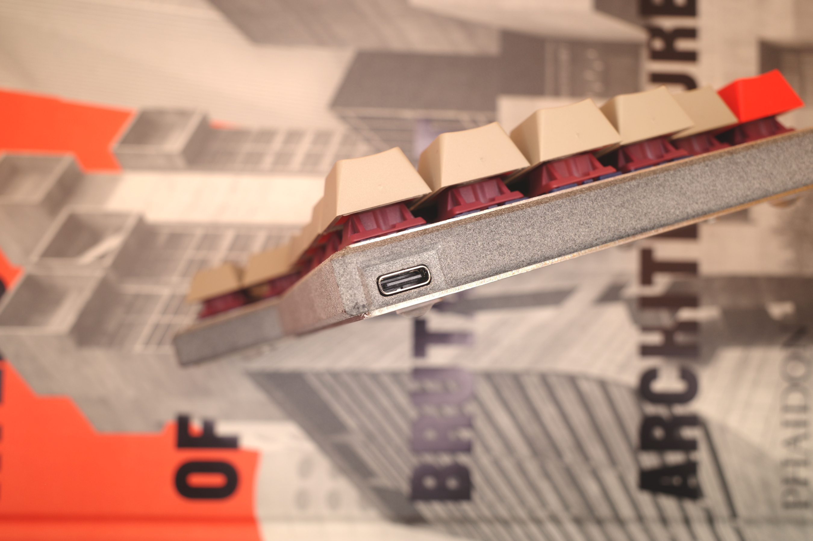
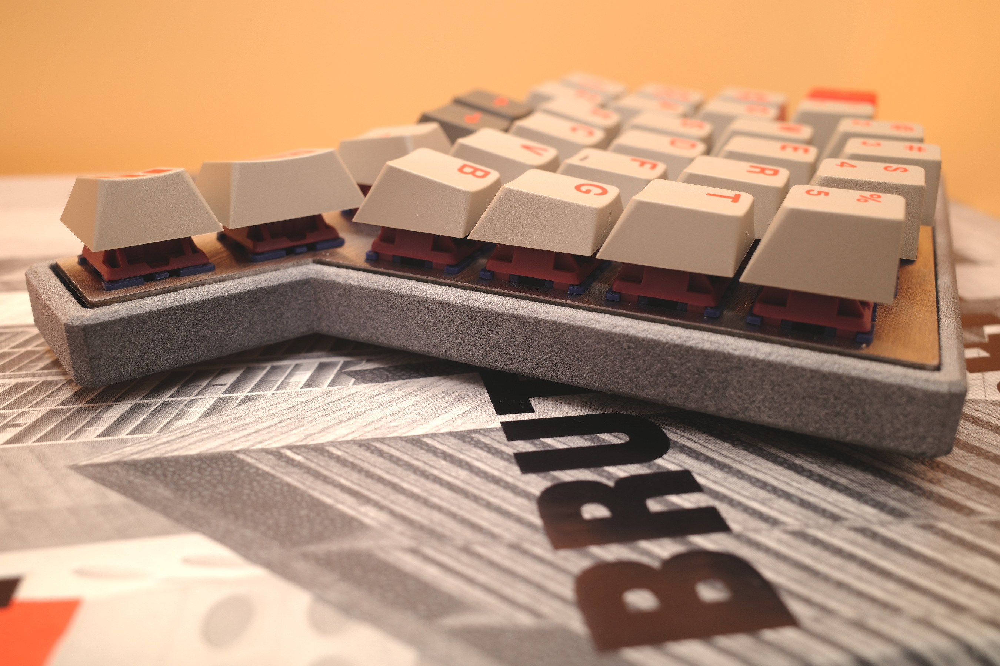
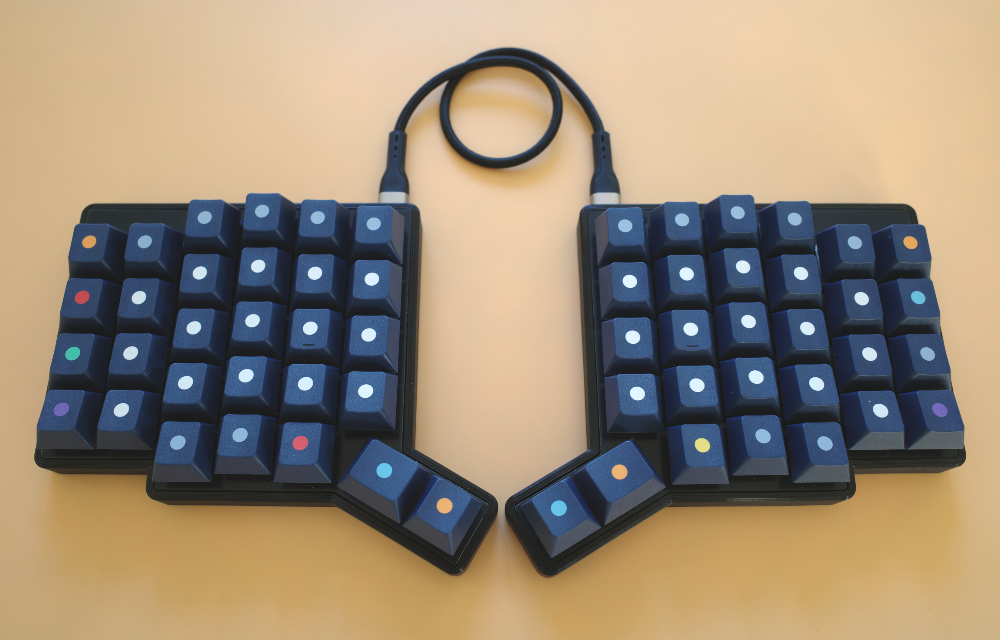
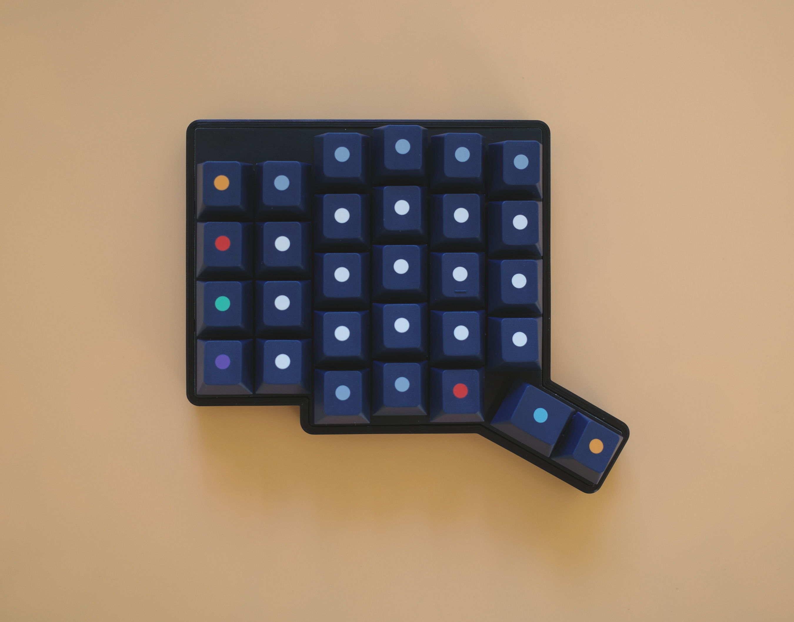
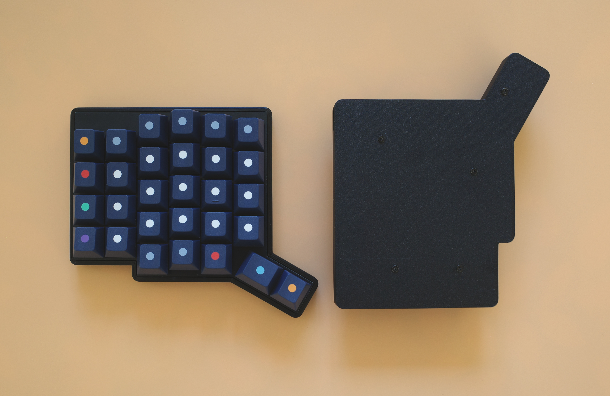
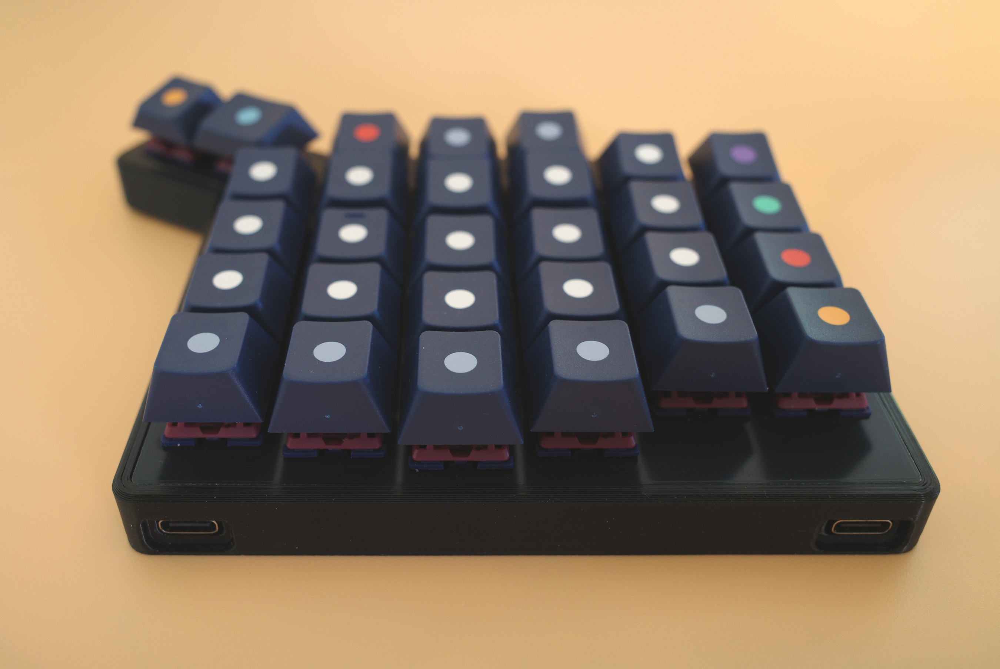
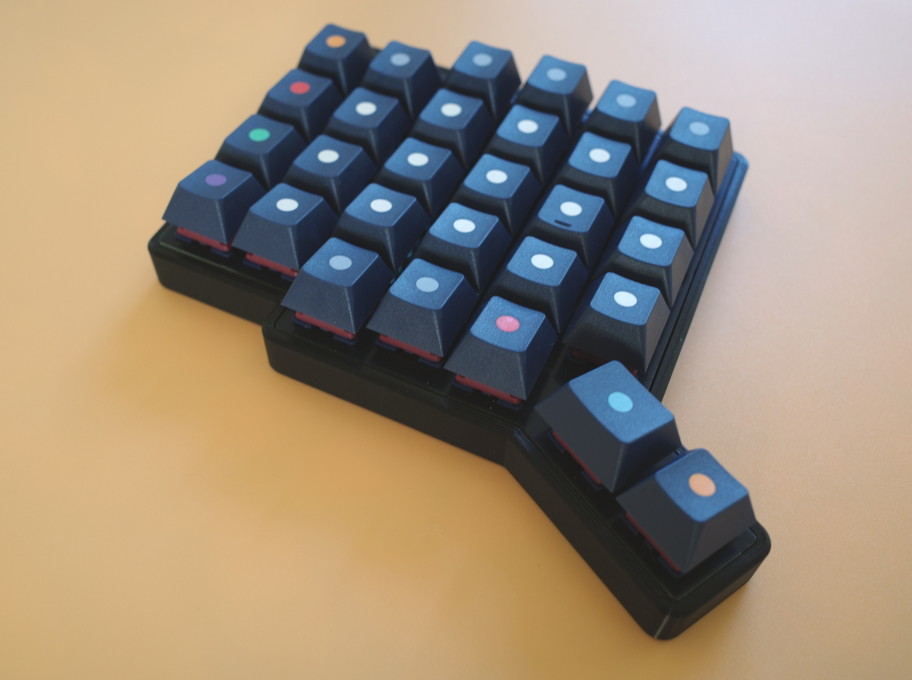

# Gallery

Here are some examples to inspire your build.

A more extensive gallery of keycap options can be found in the [Pando58 Gallery](https://jyap808.github.io/pando58/gallery).

## MJF Case

Here is the Multi-Jet Fusion (MJF) printed case, printed in PA12-HP Nylon in natural grey. It features a stainless steel switch plate and bottom plate.

This MJF case suits my design ethos — simple, functional, minimal, true to its materials. Inspired by Brutalist architecture, MJF substitutes for concrete in its raw unfinished grey tone, with stainless steel peeking out from top and bottom.

Keycaps are Keykobo Signet. I prefer sets with icon modifiers since I flip the 3 inner thumb keys upside-down for a more natural feel. For backspace, I use a flipped right arrow key.

Top view with USB-C interconnect cable.

Left half top view.

Left half, bottom view with the stainless steel plate.

Left half, view from the back.

## 3D Printed Case

Here is the 3D printed case, printed in black Ambrosia ASA filament. It features a FR4 switch plate in black. Keycaps are GMK Dots. I am a fan of keycap sets where the modifiers are minimal icons.

Top view with USB-C interconnect cable.

Left half top view.

Left half top view and right half bottom view.

Left half, view from the back.

Left half, angled view.

